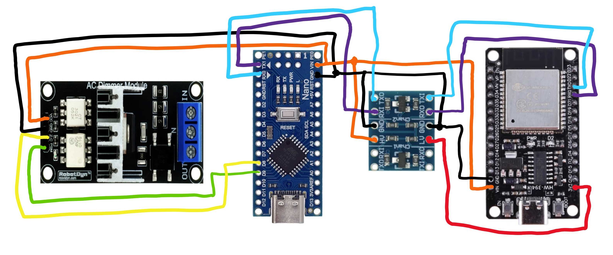
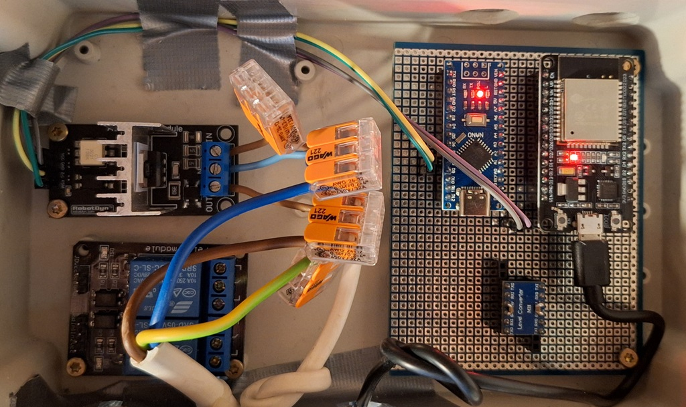
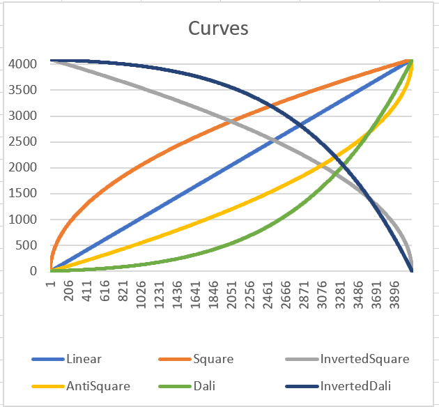

# AC-Dimmer - DALI

An AC dimmer, that uses the DALI (Digital Addressable Lighting Interface) dimming interpretation curve. See also https://en.wikipedia.org/wiki/Digital_Addressable_Lighting_Interface for more information about the DALI standard.
As a remark this implementation is NOT DALI approved and or certified, and also does not imply to be so.

***

“schematic” of the dimmer.


From left to right; the triac AC-dimmer, a Nano ATmega328P, communication level converter, ESP32.
Left, an ATmega328P for precise non-interrupted dimming, communicating with at the right and ESP32 for MQTT and WIFI connection. 
ATmega328P and ESP32 communicate with each other via a slow (no need for high speed) serial communication and because the ATmega328P works on 5V and the ESP32 on 3.3V, there is a level converter

Implementation (will make a pcb in the future).


***

This repository is only about the triac AC dimmer controller with ATmega328P, in a future repository I will add the ESP32 part with MQTT and WIFI connection.

***

Design goals:
* Priority on capturing the AC zero crossing and creation of triac dimmer pulses.
* Command control is done via a serial port at a low baud rate of 9600 baud.
  * There is no need for fast communication
  * Normally a command is executed in between 2 zero crossing, but if needed several zero crossing can occur before an actual change is processed (in practice you will not notice this)
  * IMPORTANT, do not try to increase communication baud rate, you will miss receiving characters and it is also not allowed for this implementation to make serial communication interrupt driven (to handle higher baud rates)
* Only timer and capture should be interrupt driven. No other sources (like serial communication) will use interrupts, preventing jitter for timer and capture (and in so flicker of the dimmed light)
* Controller is optimized for Dimmer control only, other “fancy” high level stuff needs to be done with an external controller.
* A DALI curve is used to directly set dimming from 0 (off) to 254 (max), this is translated to a dimming pulse (50 or 60Hz) location.
* It is also possible to implement a fade (using the DALI curve and  a delta time) to a higher or lower dimming value. 
  * Fade uses the DALI curve + interpolates in between 2 DALI points if needed to smoothen the fading. Interpolation will smoothen the fade steps
* Implementation has been done in such a way that calculation and dimmer resolution have been optimized (16 or 32 bit)
* It is possible to directly set the dimming (timer value) of the dimmer, manly for calibration purposes.
  *	This way the minimum and maximum value for the dimmer can be set (not all light sources do have the same minimum and maximum for ‘off’ and ‘full’)
  * Minimum and maximum value can be saved and will be used to project Dimming DALI settings from 0 (minimum calibrated value) to 254 (maximum calibrated value)

***
# DALI curve
Y = 10^3*(x−254)/253



Light-bulbs / LEDs behave in a non-linear way.
In essence you want to have a higher resolition at low light situations

Ideal for this is the DALI curve.

***
# Commands:

Protocol:
* `Send = <STX><data bytes><ETX>`
* `Return = <ACK>[<STX><data bytes><ETX>]`

```
// DIMMER_CMD_ Address _SIZE (bytes) Command Param1 Size min max Scratch Param2 Size min max Scratch
// DIMMER_CMD_ Address _SIZE (bytes) Command Param1 Size min max Scratch Param2 Size min max Scratch
>> Basic Off, max On, stop during Fade
#define DIMMER_CMD_OFF_ADDR                   0x00 // 0	Off
#define DIMMER_CMD_OFF_SIZE                   0
#define DIMMER_CMD_ON_MAX_ADDR                0x02 // 0 OnMax (254)
#define DIMMER_CMD_ON_MAX_SIZE                0
#define DIMMER_CMD_STOP_ADDR                  0x03 // 0 Stop (255) - -
#define DIMMER_CMD_STOP_SIZE                  0
>> Set of a dali vali dimmer value
>> Fade from current to set value in x milliseconds
>> Fade in x steps (50 or 60Hz steps)
#define DIMMER_CMD_SET_ADDR                   0x10 // 1 Set DaliValue uin8_t 0 255 -
#define DIMMER_CMD_SET_SIZE                   2
#define DIMMER_CMD_GET_SET_ADDR               0x90 // 1 Return Set value DaliValue uin8_t
#define DIMMER_CMD_GET_SET_SIZE               0
#define DIMMER_CMD_SET_FADE_TIME_ADDR         0x11 // 3 SetFadeTime DaliValue uint8_t 0 254 0 Time_ms uint16_t 100 65535 100
#define DIMMER_CMD_SET_FADE_TIME_SIZE         6
#define DIMMER_CMD_SET_FADE_STEPS_ADDR        0x12 // 2 SetFadeSteps DaliValue uint8_t 0 254 0 1/steps per fade uint8_t 1 255 1
#define DIMMER_CMD_SET_FADE_STEPS_SIZE        4
>> Save of calibration values, 50 or 60 Hz,  ‘triac” value for Off Dali value, ‘triac” value for max On Dali value
#define DIMMER_CMD_SAVE_ADDR                  0x30 // 1 Save MagicNumber uint8_t - - 0x55 -
#define DIMMER_CMD_SAVE_SIZE                  2
#define DIMMER_CMD_SAVE_MAGIC_NUMBER          0x55
#define DIMMER_CMD_LOAD_ADDR                  0x31 // 1 Load MagicNumber uint8_t - - 0x66 -
#define DIMMER_CMD_LOAD_SIZE                  2
#define DIMMER_CMD_LOAD_MAGIC_NUMBER          0x66
#define DIMMER_CMD_LOAD_SCRATCH_ADDR          0x32 // 1 LoadScratch MagicNumber uint8_t - - 0x77 -
#define DIMMER_CMD_LOAD_SCRATCH_SIZE          2
#define DIMMER_CMD_LOAD_SCRATCH_MAGIC_NUMBER  0x77

#define DIMMER_CMD_SET_MAINZ_HZ_VAL_ADDR      0x70
#define DIMMER_CMD_SET_MAINZ_HZ_VAL_SIZE      2
#define DIMMER_CMD_GET_MAINZ_HZ_VAL_ADDR      0xF0
#define DIMMER_CMD_GET_MAINZ_HZ_VAL_SIZE      0

>> Important for directly settings the “triac” value and Low and High calibration values 
A lower timer value (start from zero-crossing till fire triac) will turn the triac on at earlier moment => more light
A higher timer value (start from zero-crossing till fire triac) will turn the triac on at a later moment => less light
Set directly the ,  ‘triac” value (timer), get the current ‘triac” value (timer)
#define DIMMER_CMD_SET_TIMER_VAL_ADDR         0x71 // 2 SetTimerValue (stops all other actions) TimerValue uint16_t 0 20000
#define DIMMER_CMD_SET_TIMER_VAL_SIZE         4  
#define DIMMER_CMD_GET_TIMER_VAL_ADDR         0xF1
#define DIMMER_CMD_GET_TIMER_VAL_SIZE         0
Set the calibration On Dali ‘triac” value
#define DIMMER_CMD_SET_CAL_LOW_VAL_ADDR       0x72
#define DIMMER_CMD_SET_CAL_LOW_VAL_SIZE       4
#define DIMMER_CMD_GET_CAL_LOW_VAL_ADDR       0xF2
#define DIMMER_CMD_GET_CAL_LOW_VAL_SIZE       0
Set the calibration Off Dali ‘triac” value (do use the save command to permanently save)
#define DIMMER_CMD_SET_CAL_HIGH_VAL_ADDR      0x73 // 2 SetCalHigherValue (update Dali table) (use Save function) TimerValue uint16_t 0 20000
#define DIMMER_CMD_SET_CAL_HIGH_VAL_SIZE      4
#define DIMMER_CMD_GET_CAL_HIGH_VAL_ADDR      0xF3
#define DIMMER_CMD_GET_CAL_HIGH_VAL_SIZE      0
#define DIMMER_CMD_GET_CAL_RANGE_VAL_ADDR     0xF4 // GetCalRange, 20000 for 50Hz and 16666 for 60Hz
#define DIMMER_CMD_GET_CAL_RANGE_VAL_SIZE     0

#define DIMMER_CMD_GET_CMD_VERSION_ADDR       0xF9	// 0 GetCmdVersion	Version	uint8_t 1
#define DIMMER_CMD_GET_CMD_VERSION_SIZE       0

#define DIMMER_CMD_GET_VERSION_ADDR           0xFA	// 0 GetVersion	Version	uint8_t 1
#define DIMMER_CMD_GET_VERSION_SIZE           0
```
